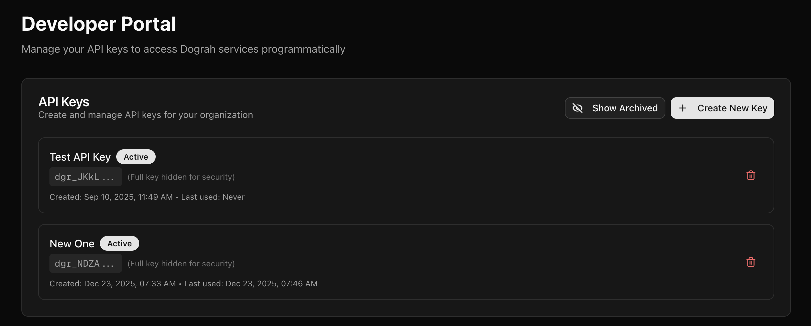
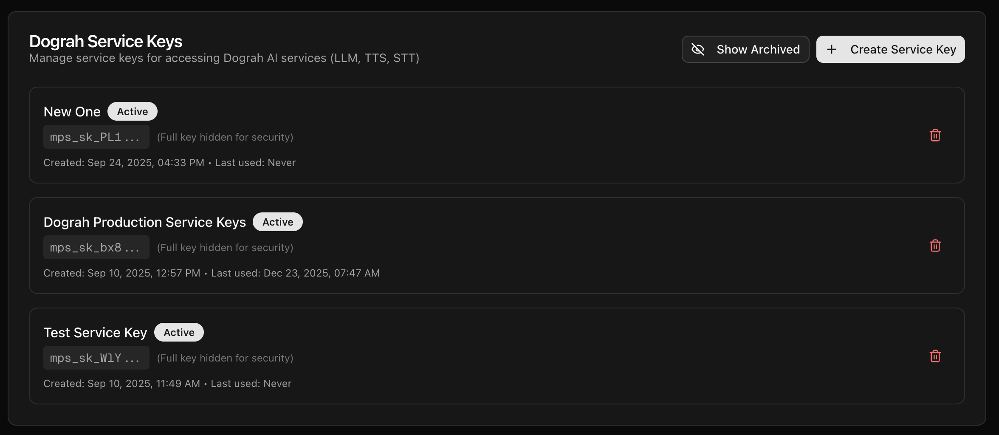

The option to create the Keys are in https://app.echowave.com/api-keys if you are using hosted version, or http://localhost:3010/api-keys if you are using the self hosted version.

### API Keys
API keys can be used to trigger a voice agent from an external system, like n8n or programatically from your other workflows. In order to generate that, you can go to `/api-keys` and create a new key. 

Please note that you must copy and keep the API key secretly, since this is the only time that you would be able to copy it. If you lose it, you can always delete that, if its not being used anywhere, and create a new API key. 

### Service Keys
Service Keys are the keys which you generate to be used in [Model Configurations](inference-providers). In order to generate that, you can go to `/api-keys` and create a new key. 

<Note>
You can use a Service Key created in EchoWave Cloud (`https://app.echowave.com/api-keys`) in your self-hosted EchoWave deployment. Create the Service Key from your EchoWave Cloud account, then paste it into **Model Configurations** in your self-hosted instance to use EchoWave-managed inference providers. You can purchase EchoWave credits in EchoWave Cloud; billing happens on the Cloud account that owns the Service Key.
</Note>

<Warning>
Service Keys are scoped to the EchoWave Cloud account that created them. You cannot use a Service Key from one cloud-hosted account in another cloud-hosted account; create a new Service Key from the account where you want to use it.
</Warning>
