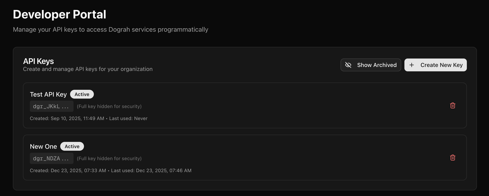
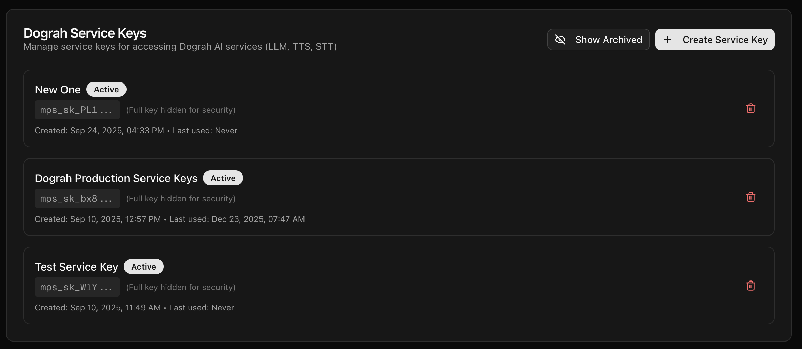

Create and manage keys at [app.decibyl.ai/api-keys](https://app.decibyl.ai/api-keys).

### API Keys
API keys can be used to trigger a voice agent from an external system, like n8n or programatically from your other workflows. In order to generate that, you can go to `/api-keys` and create a new key. 

Please note that you must copy and keep the API key secretly, since this is the only time that you would be able to copy it. If you lose it, you can always delete that, if its not being used anywhere, and create a new API key. 

### Service Keys
Service Keys are the keys which you generate to be used in [Model Configurations](inference-providers). In order to generate that, you can go to `/api-keys` and create a new key. 

<Note>
A Service Key is what lets an agent use Decibyl-managed inference providers instead of your own provider keys. Model usage is billed to the account that owns the key, drawn from that account's Decibyl balance.
</Note>

<Warning>
Service Keys are scoped to the account that created them. A key from one account cannot be used in another — create a new Service Key from the account you want the usage billed to.
</Warning>
