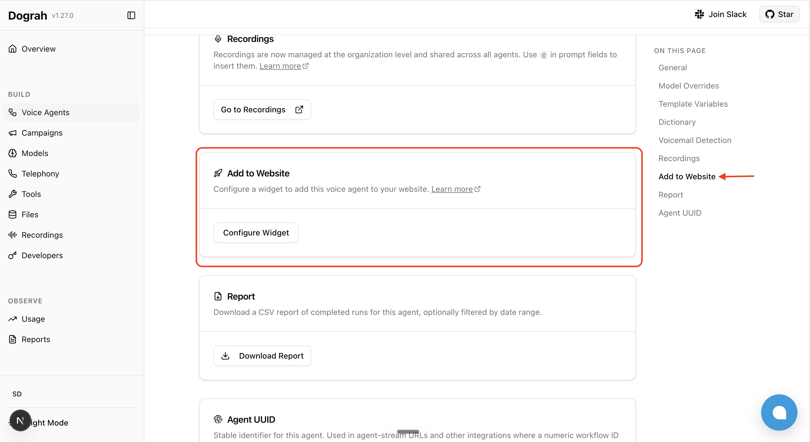
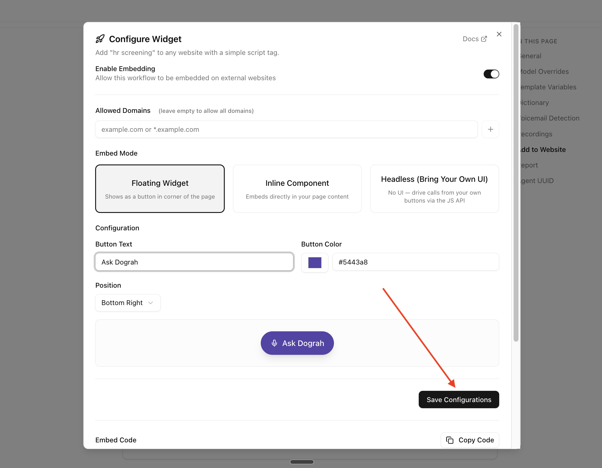
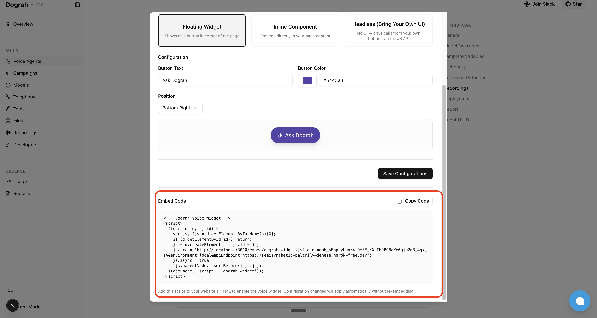
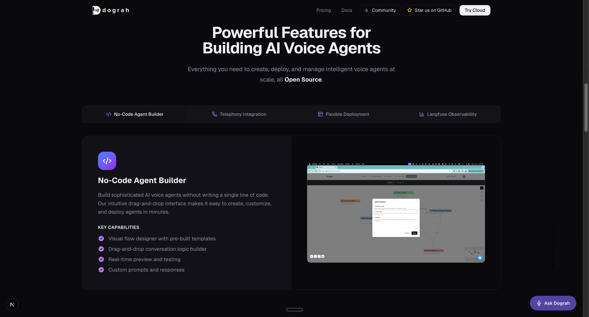
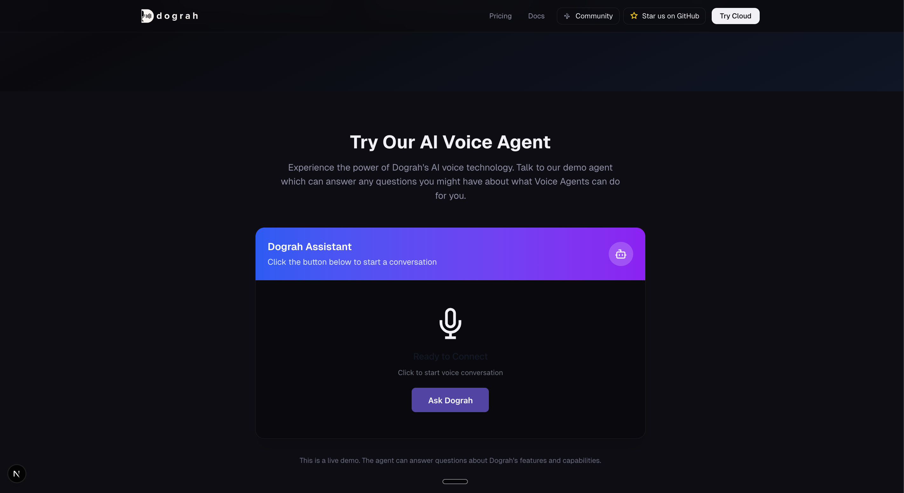
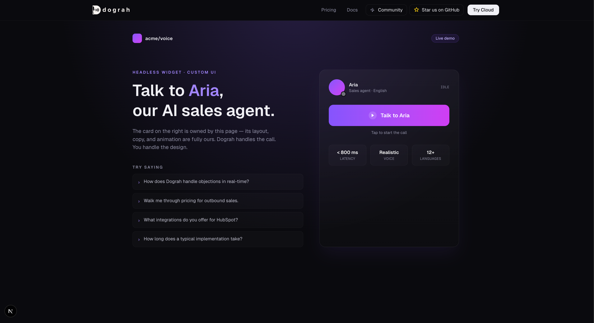

### How to add it

Add your voice agent to any website using the Configure Widget dialog in your agent's settings.

Step 1: Open the agent settings by clicking the gear icon in the top-right of the agent editor.


Step 2: Scroll to the **Add to Website** section and click **Configure Widget**.



Step 3: Enable embedding, add your website's domain to **Allowed Domains**, choose **Floating Widget**, **Inline Component**, or **Headless (Bring Your Own UI)**, customize the button (position, color, text) if applicable, and click **Save Configurations**.



Step 4: Copy the generated embed code and paste it into your web page to test your agent.



## Embed modes

| Mode                  | What it renders                                                                                    | When to use                                                                                          |
| --------------------- | -------------------------------------------------------------------------------------------------- | ---------------------------------------------------------------------------------------------------- |
| **Floating Widget**   | A pill-shaped CTA button anchored to a corner of the page.                                         | You want a turn-key chat-bubble experience that doesn't disturb your existing layout.                |
| **Inline Component**  | A panel rendered inside a `<div id="echowave-inline-container">` that you place in your page.        | You want the agent embedded in a specific section (landing-page hero, support tab, etc.).            |
| **Headless**          | No UI. Only the audio pipeline plus a JavaScript API on `window.EchoWaveWidget`.                     | You want full control over the UI — your own buttons, design system, framework state, animations.    |

## Prerequisites

These apply to all three modes:

- Serve your page over **HTTPS** or from `http://localhost`. Browsers refuse microphone access on plain HTTP origins or `file://`.
- If you set **Allowed Domains** in the dashboard, include your test origin (e.g. `localhost`) — otherwise the widget's config and signaling requests are rejected. Leave the list empty to allow all domains.
- The embed snippet you copy from the dashboard is a single `<script>` tag that loads `echowave-widget.js` **asynchronously**. The widget auto-initializes once it loads and exposes `window.EchoWaveWidget`. Code that registers callbacks must wait for the widget to be available.

## Floating Widget



Renders a pill-shaped button (microphone icon + text) anchored to a corner of the page. Clicking it starts a call; clicking again ends it. The button auto-updates its label and color across the call lifecycle: configured text → "Connecting…" → "End Call" → "Retry" on failure.

Configure **Button Text**, **Button Color**, and **Position** (top/bottom + left/right) from the dashboard.

The host page writes no JavaScript — pasting the embed snippet is the entire integration. If you want to subscribe to call lifecycle events (e.g. analytics), see [Lifecycle callbacks](#lifecycle-callbacks-all-modes) below

## Inline Component



Renders a panel (status icon + status text + CTA button) inside a `<div>` you place in your page. Status changes update the panel in place.

Configure **Button Text**, **Button Color**, and **Call to Action Text** from the dashboard.

### Plain HTML

Place a container `<div>` where you want the widget to render. The widget auto-attaches to it.

```html
<!-- Paste the echowave embed snippet from the dashboard somewhere on the page -->
<div id="echowave-inline-container"></div>
```

### React

Because React mounts after the widget script may have already loaded, integrate via `initInline` on first mount and `refresh` on remount. Poll for `window.EchoWaveWidget` to handle the async script load.

```tsx
import { useEffect } from 'react';

declare global {
  interface Window {
    EchoWaveWidget?: {
      initInline: (options: { container: HTMLElement }) => void;
      refresh: () => void;
      getState: () => { isInitialized: boolean };
    };
  }
}

export function Assistant() {
  useEffect(() => {
    let retries = 0;
    const tryInit = () => {
      const container = document.getElementById('echowave-inline-container');
      if (window.EchoWaveWidget && container) {
        const { isInitialized } = window.EchoWaveWidget.getState();
        if (isInitialized) window.EchoWaveWidget.refresh();
        else window.EchoWaveWidget.initInline({ container });
      } else if (retries++ < 50) {
        setTimeout(tryInit, 100);
      }
    };
    tryInit();
  }, []);

  return <div id="echowave-inline-container" />;
}
```

## Headless Mode



In Headless mode the widget injects no UI of its own. You render whatever buttons, banners, or in-call indicators you want, and call the JavaScript API to start and end calls.

### JavaScript API

| Method / Callback                              | Description                                                                                                                                                  |
| ---------------------------------------------- | ------------------------------------------------------------------------------------------------------------------------------------------------------------ |
| `window.EchoWaveWidget.start()`                  | Begin a voice call. Must be called from inside a user-gesture handler (e.g. `click`) so the browser grants microphone access.                                |
| `window.EchoWaveWidget.end()`                    | End the active call.                                                                                                                                         |
| `window.EchoWaveWidget.onCallStart(cb)`          | Fires when `start()` is invoked (status `connecting`). No payload.                                                                                           |
| `window.EchoWaveWidget.onCallConnected(cb)`      | Fires when the WebRTC connection is established. Payload: `{ agentId, workflowRunId, token }`.                                                               |
| `window.EchoWaveWidget.onCallDisconnected(cb)`   | Fires only if the call had connected, when teardown runs. Payload: `{ agentId, workflowRunId, token, durationSeconds }`.                                     |
| `window.EchoWaveWidget.onCallEnd(cb)`            | Fires whenever the call session is torn down (including failed-to-connect attempts). No payload.                                                             |
| `window.EchoWaveWidget.onStatusChange(cb)`       | Fires on every status change. Callback receives `(status, text, subtext)`. Status values: `idle`, `connecting`, `connected`, `failed`.                       |
| `window.EchoWaveWidget.onError(cb)`              | Fires on errors (mic permission denied, server error, etc.). Callback receives an `Error` object.                                                            |

All `on*` setters are single-listener — calling the same one again replaces the previous handler.

<Note>
**About timing.** The widget script loads asynchronously, so `window.EchoWaveWidget` may not exist at the moment your inline `<script>` first runs. The examples below assume `window.EchoWaveWidget` is already available when registration runs. To guarantee that:

- **Vanilla JS:** wrap your registration code in `window.addEventListener('load', () => { /* register here */ })`.
- **React:** inside `useEffect`, register immediately if `document.readyState === 'complete'`, otherwise add a one-time `window.load` listener that registers on fire.
- **Click handlers** that call `start()` / `end()` don't need a guard — by the time a user clicks, the widget has long since loaded.
</Note>

### Vanilla JS

```html
<button id="talk-btn">Talk to AI</button>

<script>
  let callStatus = 'idle';
  const btn = document.getElementById('talk-btn');

  function render() {
    btn.textContent =
      callStatus === 'connected' ? 'End Call'
      : callStatus === 'connecting' ? 'Connecting…'
      : callStatus === 'failed' ? 'Retry'
      : 'Talk to AI';
  }

  window.EchoWaveWidget.onStatusChange((status) => {
    callStatus = status;
    render();
  });

  window.EchoWaveWidget.onError((err) => {
    console.error('EchoWave error:', err.message);
  });

  btn.addEventListener('click', () => {
    if (callStatus === 'connected' || callStatus === 'connecting') {
      window.EchoWaveWidget.end();
    } else {
      window.EchoWaveWidget.start();
    }
  });
</script>
```

### React + TypeScript

```tsx
import { useEffect, useState } from 'react';

type CallStatus = 'idle' | 'connecting' | 'connected' | 'failed';

declare global {
  interface Window {
    EchoWaveWidget: {
      start: () => void;
      end: () => void;
      onStatusChange: (cb: (status: CallStatus, text?: string, subtext?: string) => void) => void;
      onError: (cb: (err: Error) => void) => void;
    };
  }
}

export function TalkButton() {
  const [status, setStatus] = useState<CallStatus>('idle');

  useEffect(() => {
    window.EchoWaveWidget.onStatusChange((s) => setStatus(s));
    window.EchoWaveWidget.onError((err) => console.error('EchoWave error:', err.message));
  }, []);

  const isLive = status === 'connected' || status === 'connecting';
  const label = { idle: 'Talk to AI', connecting: 'Connecting…', connected: 'End Call', failed: 'Retry' }[status];

  return (
    <button onClick={() => (isLive ? window.EchoWaveWidget.end() : window.EchoWaveWidget.start())}>
      {label}
    </button>
  );
}
```

<Note>
`start()` must run inside a real user-gesture handler (`click`, `touchend`, etc.). Browsers refuse to grant microphone access to scripts that request it outside of one — calling `start()` from a `setTimeout` or on page load will fail with a permission error.
</Note>

## Lifecycle callbacks (all modes)

The `on*` callbacks in the [Headless JavaScript API](#javascript-api) work in **all three embed modes**, not just Headless. Use them for analytics or to trigger UI in the host page even when the widget is rendering its own UI (Floating or Inline).

```js
window.EchoWaveWidget.onCallConnected(({ agentId, workflowRunId }) => {
  analytics.track('voice_call_started', { agentId, workflowRunId });
});

window.EchoWaveWidget.onCallDisconnected(({ workflowRunId, durationSeconds }) => {
  analytics.track('voice_call_ended', { workflowRunId, durationSeconds });
});
```

`onCallConnected` and `onCallDisconnected` only fire when the call actually establishes a media connection — failed-to-connect attempts (e.g. denied mic, network failure) don't trigger them, so analytics stay clean.
