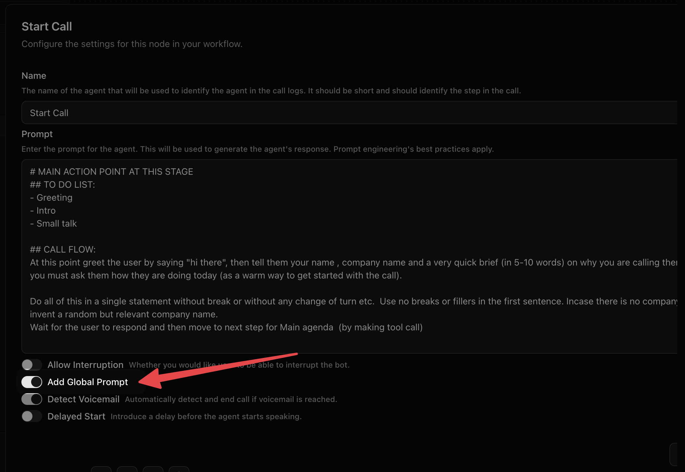

A global node holds the instructions that are true for the entire call. Its
prompt is prepended to every prompted node whose **Add Global Prompt** is on,
at runtime, so the model reads it on every turn without you repeating it
anywhere.

There is at most one per agent, and it connects to nothing — no incoming edges,
no outgoing edges. It is not a step of the conversation.



## What belongs in it

Things that would be wrong to forget on any single turn:

- **Persona.** Who the agent is, who it works for, and how it speaks.
- **Language rules.** Which language to answer in, and what to do when the
  caller switches mid-sentence.
- **Hard limits.** What it must never say, promise, quote or agree to.
- **Voice conventions.** No markdown, no bullet points, no characters that
  cannot be pronounced, short sentences.

And what does not: anything about *this step*. "Ask for their budget" belongs in
the node that asks for the budget. A global prompt full of step instructions is
read on every turn, which both costs more and gives the model contradictory
things to do.

```text title="A global prompt"
You are Meera, calling on behalf of Sunrise Dental in Bengaluru. You are warm,
brief and never pushy.

Speak in the language the caller uses. If they start in Hindi, stay in Hindi.
If they mix Hindi and English, mix them back — do not correct them and do not
switch to formal Hindi.

Use short sentences. This is spoken aloud, so never use markdown, lists,
symbols, or abbreviations that cannot be read out.

Never quote a price beyond the ₹500 consultation fee. For anything else, say it
depends on the examination and offer to book one.

If the caller asks not to be contacted again, confirm that you have noted it,
apologise once, and end the call. Do not attempt to continue.
```

## Fields

<ParamField path="name" type="string" default="Global Node">
Label on the canvas. No runtime effect.
</ParamField>

<ParamField path="prompt" type="string" required>
The text prepended to every prompted node with **Add Global Prompt** on.
Supports `{{template_variables}}`.
</ParamField>

## Which nodes receive it

Only nodes with **Add Global Prompt** switched on. The defaults are chosen so
this usually does the right thing without being touched:

| Node | Default | Why |
|---|---|---|
| [Start Call](/voice-agent/start-call) | On | The persona has to be right from the first word |
| [Agent](/voice-agent/agent) | On | Every conversational turn |
| [End Call](/voice-agent/end-call) | **Off** | A closing line rarely needs the full persona, and objection-handling instructions are the last thing you want the model reading as it says goodbye |

<Note>
A rule that only applies on some nodes is not really a rule. If you find
yourself turning **Add Global Prompt** off on an agent node to escape a global
instruction, the instruction probably belongs in the nodes that need it instead.
</Note>

## Length

Every token here is read on every turn of every call. A global prompt that grows
to two pages makes each turn slower, more expensive, and — because a long
instruction list is followed less reliably than a short one — less obedient.

If it is getting long, most of it is usually step instructions that drifted up
from the nodes. Move them back down.

## Rules

- **At most one** global node per agent.
- No incoming and no outgoing edges.
- An agent with no global node is perfectly valid; every node just uses its own
  prompt alone.

## See also

<CardGroup cols={2}>
  <Card title="Agent node" href="/voice-agent/agent">
    Where step-specific instructions belong.
  </Card>
  <Card title="Start Call" href="/voice-agent/start-call">
    Greeting, disclosure and the opening turn.
  </Card>
  <Card title="Template variables" href="/voice-agent/template-variables">
    Using `{{variables}}` in a prompt.
  </Card>
  <Card title="Editing a workflow" href="/voice-agent/editing-a-workflow">
    Getting around the canvas.
  </Card>
</CardGroup>
